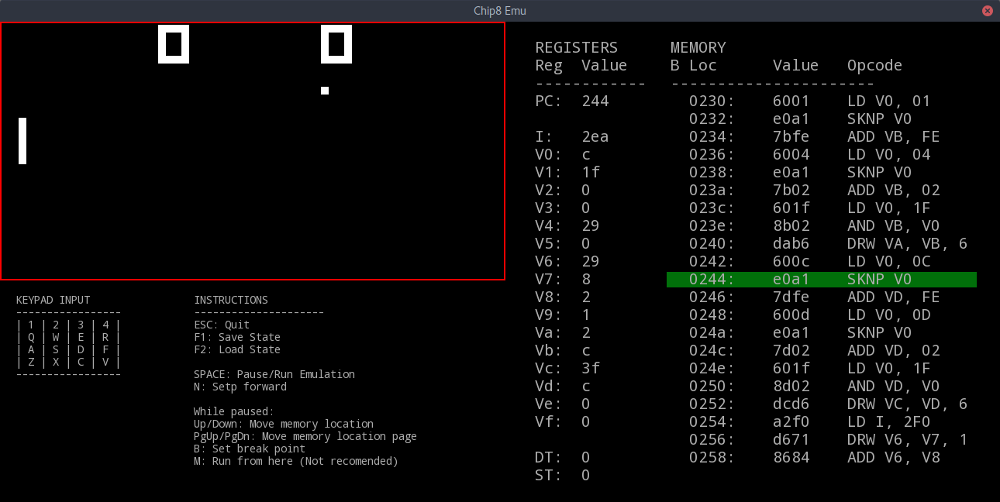

# Chip-8 Emulator in C #
This version of the chip-8 emulator is a port for a c++ version I made a while ago. I cleaned up the code and moved it from a large switch statement to function pointers to clean it up and make it easier to follow

The emulator application is is written in c++.

I wanted to port this over to a ARM Cortex-M0 MCU but was running into lots of problems, so I decided to first make a port to C for the desktop.

I also wanted to work on a 6502 Emulator but wanted to clean this up first as a starting point for the larger more complicated emulator



## Compile ##
You will need the sfml(https://www.sfml-dev.org/) libs installed to compile and run this.
```
g++ -c Chip8Emulator.cpp  Chip8.c Chip8Disassembler.c Chip8Assembler.c
g++ Chip8.o Chip8Emulator.o Chip8Disassembler.o Chip8Assembler.o -o Chip8Emu -lsfml-graphics -lsfml-window -lsfml-system
```

## Running ##
to play a game simple run it with the game file
```
Chip8Emu gamefile.c8
```

If you want to compile a file use this command:
```
Chip8Emu -a filenamein.c8 filenameout.c8
```

If you want to disassemble a file use this command:
```
Chip8Emu -d filenamein.c8 filenameout.c8
```

## Dissasember ##
Like most Dissassember this has limited use, but was built for the debugger

## Assember ##
The Assembler uses the opcodes and format found here: [Technical Reference(used for this emulator)](http://devernay.free.fr/hacks/chip8/C8TECH10.HTM)
It also uses dw to store a word of data db to store a byte of data and dc to store a string for an example of a program in the correct format see sctest.c8

## Documentation ##
Have a look at the source files, they are well documented

## About the Chip-8 interpreter ##
Chip-8 is a simple, interpreted, programming language which was first used on some do-it-yourself computer systems 
in the late 1970s and early 1980s. The COSMAC VIP, DREAM 6800, and ETI 660 computers are a few examples. 
These computers typically were designed to use a television as a display, had between 1 and 4K of RAM, and used a 16-key hexadecimal keypad for input. 
The interpreter took up only 512 bytes of memory, and programs, which were entered into the computer in hexadecimal, were even smaller.

In the early 1990s, the Chip-8 language was revived by a man named Andreas Gustafsson. He created a Chip-8 interpreter for the HP48 graphing calculator, 
called Chip-48. The HP48 was lacking a way to easily make fast games at the time, and Chip-8 was the answer. Chip-48 later begat Super Chip-48, 
a modification of Chip-48 which allowed higher resolution graphics, as well as other graphical enhancements.

Chip-48 inspired a whole new crop of Chip-8 interpreters for various platforms, including MS-DOS, Windows 3.1, Amiga, HP48, MSX, Adam, and ColecoVision.

[Technical Reference(used for this emulator)](http://devernay.free.fr/hacks/chip8/C8TECH10.HTM)

[More information on Wikipedia](https://en.wikipedia.org/wiki/CHIP-8)
